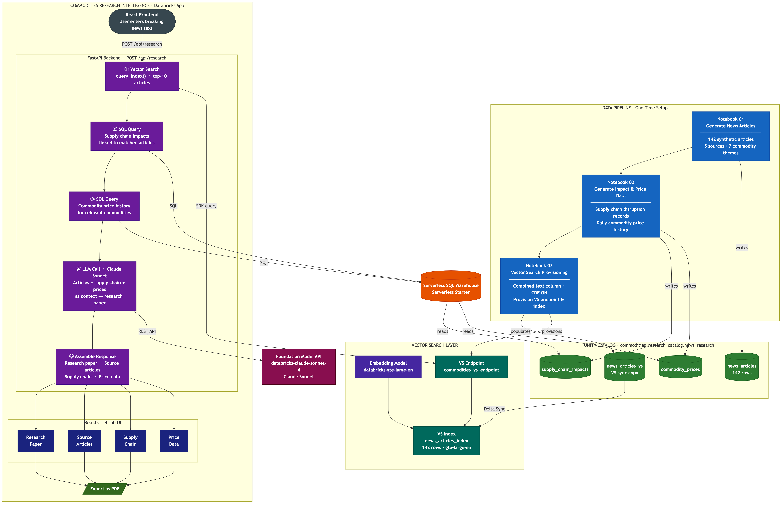

# Commodities Research Intelligence

AI-powered commodities research platform that takes breaking news input, retrieves relevant market intelligence from a curated news corpus, and generates institutional-grade research papers analyzing commodity price impacts, supply chain disruptions, and market dynamics.



## Overview

This application combines **Databricks Vector Search**, **Unity Catalog**, and **Foundation Model APIs** to deliver an end-to-end research workflow:

1. A user enters a breaking news event (e.g., "Iran announces closure of Strait of Hormuz")
2. The system semantically searches 142+ commodities news articles from 5 major sources
3. Related supply chain impact data and commodity price history are retrieved
4. Claude Sonnet generates a comprehensive research paper with quantitative analysis
5. Results are presented across 4 interactive tabs with PDF export capability

## Architecture

### Data Pipeline (One-Time Setup)

Three Databricks notebooks run sequentially on serverless compute to build the data layer:

| Notebook | Purpose | Output Table |
|----------|---------|-------------|
| `01_generate_news_data.py` | Generates ~142 synthetic news articles from Bloomberg, Reuters, S&P Global, CNBC, and Financial Times across 7 themes | `news_articles` |
| `02_generate_supply_chain_data.py` | Creates supply chain impact records and daily commodity price history (Mar 1 - Apr 8, 2026) | `supply_chain_impacts`, `commodity_prices` |
| `03_setup_vector_search.py` | Prepares embedding text, provisions Vector Search endpoint, creates Delta Sync index | `news_articles_vs` + VS Index |

**News themes covered:**
- Strait of Hormuz / Iran crisis
- Oil price volatility (Brent/WTI)
- Industrial metals (copper at record LME highs)
- European natural gas surge
- Fertilizer supply disruption
- Helium shortage impacting chipmaking
- Agriculture and wheat markets

**Commodities tracked (25):** Crude Oil, Brent, WTI, Natural Gas, LNG, Gold, Silver, Copper, Aluminum, Platinum, Wheat, Corn, Soybeans, Rice, Sugar, Iron Ore, Lithium, Nickel, Zinc, Palladium, Urea, Methanol, Sulfur, Helium, Cobalt

### Application Runtime Flow

```
User Input (Breaking News)
        |
        v
  React Frontend  ──POST /api/research──>  FastAPI Backend
                                                |
                    ┌───────────────────────────┼───────────────────────────┐
                    v                           v                           v
            Vector Search               SQL Warehouse               SQL Warehouse
         (query_index API)          (supply_chain_impacts)       (commodity_prices)
         top 10 articles             linked to matched            for relevant
         by similarity               article IDs                  commodities
                    |                           |                           |
                    └───────────────────────────┼───────────────────────────┘
                                                |
                                                v
                                   Foundation Model API
                                  (databricks-claude-sonnet-4)
                                    generates research paper
                                                |
                                                v
                                   JSON Response returned
                                   (paper + articles + supply chain + prices)
                                                |
                                                v
                                        React Frontend
                                   renders 4 tabs + PDF export
```

### Infrastructure

| Component | Resource |
|-----------|----------|
| **Workspace** | FEVM Serverless (`fevm-commodities-research`) |
| **Catalog** | `commodities_research_catalog.news_research` |
| **Vector Search Endpoint** | `commodities_vs_endpoint` (STANDARD) |
| **Vector Search Index** | `news_articles_index` (Delta Sync, `databricks-gte-large-en`) |
| **LLM** | `databricks-claude-sonnet-4` (Foundation Model API) |
| **Embeddings** | `databricks-gte-large-en` |
| **SQL Warehouse** | Serverless Starter Warehouse |
| **App Compute** | Databricks Apps (Medium) |

## Project Structure

```
ResearchNews/
├── README.md
├── architecture.png              # Mermaid architecture diagram
├── notebooks/
│   ├── 01_generate_news_data.py          # News article generation
│   ├── 02_generate_supply_chain_data.py  # Supply chain + price data
│   └── 03_setup_vector_search.py         # Vector search setup
└── app/
    ├── app.yaml                  # Databricks App configuration
    ├── requirements.txt          # Python dependencies
    ├── main.py                   # FastAPI backend
    └── static/
        └── index.html            # React frontend (single-file)
```

## Data Model

### `news_articles`
| Column | Type | Description |
|--------|------|-------------|
| `article_id` | STRING | Unique article identifier |
| `source` | STRING | News source (Bloomberg, Reuters, etc.) |
| `headline` | STRING | Article headline |
| `body` | STRING | Full article text |
| `published_at` | TIMESTAMP | Publication timestamp |
| `commodities` | ARRAY\<STRING\> | Mentioned commodities |
| `primary_commodity` | STRING | Primary commodity focus |
| `region` | STRING | Geographic region |
| `sector` | STRING | Market sector |
| `sentiment_score` | DOUBLE | Sentiment (-1 to 1) |
| `relevance_score` | DOUBLE | Relevance score (0 to 1) |

### `supply_chain_impacts`
| Column | Type | Description |
|--------|------|-------------|
| `record_id` | STRING | Unique record identifier |
| `article_id` | STRING | FK to news_articles |
| `commodity` | STRING | Affected commodity |
| `disruption_type` | STRING | Type of disruption |
| `impact_level` | STRING | Critical / High / Medium / Low |
| `severity_score` | DOUBLE | Severity (0 to 1) |
| `affected_route` | STRING | Trade route affected |
| `affected_facility` | STRING | Key facility impacted |
| `price_change_pct` | DOUBLE | Price impact percentage |
| `volume_disrupted_pct` | DOUBLE | Volume disruption percentage |
| `mitigation_strategy` | STRING | Recommended mitigation |

### `commodity_prices`
| Column | Type | Description |
|--------|------|-------------|
| `commodity` | STRING | Commodity name |
| `trade_date` | TIMESTAMP | Trading date |
| `open_price` | DOUBLE | Opening price |
| `high_price` | DOUBLE | Daily high |
| `low_price` | DOUBLE | Daily low |
| `close_price` | DOUBLE | Closing price |
| `volume` | LONG | Trading volume |

## App Features

- **Semantic search** — Vector search finds the most relevant articles regardless of keyword overlap
- **Multi-source analysis** — Cross-references news from 5 major outlets
- **Supply chain mapping** — Links disruptions to specific trade routes, facilities, and downstream industries
- **AI research generation** — Claude Sonnet produces structured research papers with executive summary, price analysis, risk scenarios, and recommendations
- **Interactive UI** — 4 tabs for research paper, source articles, supply chain data, and price cards
- **PDF export** — Download the full report as a professionally formatted PDF with appendices

## Deployment

### Prerequisites
- Databricks FEVM workspace with serverless compute
- Unity Catalog enabled
- Access to Foundation Model API endpoints

### Steps

1. **Deploy workspace** — Create a new FEVM serverless workspace or use an existing one

2. **Run data notebooks** — Execute in order on serverless compute:
   ```
   01_generate_news_data.py
   02_generate_supply_chain_data.py
   03_setup_vector_search.py
   ```

3. **Create the app**:
   ```bash
   databricks apps create commodities-research --profile=<profile>
   ```

4. **Grant permissions** to the app's service principal:
   ```sql
   GRANT USE_CATALOG, USE_SCHEMA, SELECT
   ON CATALOG commodities_research_catalog
   TO `<service-principal-client-id>`
   ```

5. **Deploy the app**:
   ```bash
   databricks apps deploy commodities-research \
     --source-code-path /Workspace/Users/<user>/commodities-research-app \
     --profile=<profile>
   ```

## Technology Stack

| Layer | Technology |
|-------|-----------|
| Frontend | React 18, Babel (in-browser), html2pdf.js |
| Backend | FastAPI, Uvicorn |
| AI/ML | Claude Sonnet 4 (LLM), GTE-Large-EN (Embeddings) |
| Search | Databricks Vector Search (Delta Sync) |
| Data | Delta Lake, Unity Catalog |
| Compute | Databricks Apps, Serverless SQL, Serverless Jobs |
| Infrastructure | Databricks FEVM (AWS) |
